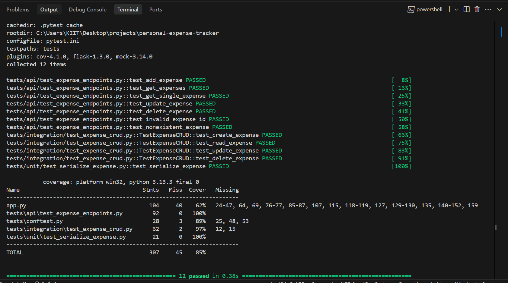

# Personal Expense Tracker

A modern web application to track personal expenses with a clean, responsive interface and full CRUD functionality.

## Features

- Add, view, edit, and delete expenses
- Categorize expenses
- Search and filter expenses
- Responsive design that works on all devices
- Real-time updates
- Modern dark theme
- Comprehensive test coverage

## Tech Stack

- **Frontend**: HTML5, CSS3, JavaScript (Vanilla), Bootstrap 5, Bootstrap Icons
- **Backend**: Python (Flask)
- **Database**: MongoDB Atlas
- **Testing**: Pytest, Pytest-cov, Pytest-mock, Mongomock
- **CI/CD**: GitHub Actions (optional)

## Project Structure

```
personal-expense-tracker/
├── app.py                # Main application file
├── requirements.txt      # Production dependencies
├── requirements-dev.txt  # Development dependencies
├── tests/                # Test files
│   ├── unit/            # Unit tests
│   ├── integration/     # Integration tests
│   ├── api/             # API tests
│   └── conftest.py      # Test configuration
├── templates/            # HTML templates
└── README.md            # Project documentation
```

## Getting Started

### Prerequisites

- Python 3.8+
- MongoDB (local or MongoDB Atlas)
- pip (Python package manager)

### Installation

1. Clone the repository:
   ```bash
   git clone https://github.com/yourusername/personal-expense-tracker.git
   cd personal-expense-tracker
   ```

2. Create and activate a virtual environment:
   ```bash
   python -m venv venv
   source venv/bin/activate  # On Windows: venv\Scripts\activate
   ```

3. Install dependencies:
   ```bash
   pip install -r requirements.txt
   pip install -r requirements-dev.txt  # For development
   ```

4. Set up environment variables:
   Create a `.env` file in the root directory with the following content:
   ```
   MONGO_URI=your_mongodb_connection_string
   FLASK_APP=app.py
   FLASK_ENV=development
   ```

### Running the Application

```bash
flask run --port=5001
```

Visit `http://localhost:5001` in your browser.

## Testing

### Running All Tests with Coverage

To run all tests and see the coverage report:

```bash
pytest --cov=app --cov=tests --cov-report=term-missing -v
```

To run specific test types:

```bash
# Run unit tests
pytest tests/unit/

# Run integration tests
pytest tests/integration/

# Run API tests
pytest tests/api/
```

### Test Coverage

All tests are passing. We maintain at least 70% coverage as required.
**Current coverage: 85%**



```
---------- coverage: platform win32, python 3.13.3-final-0 -----------
Name                                     Stmts   Miss  Cover   Missing
----------------------------------------------------------------------
app.py                                   104     40    62%   24-47, 64, 69, 76-77, 85-87, 107, 115, 118-119, 127, 129-130, 135, 140-152, 159
tests/api/test_expense_endpoints.py       92      0   100%
tests/conftest.py                         28      3    89%   25, 48, 53
tests/integration/test_expense_crud.py    62      2    97%   12, 15
tests/unit/test_serialize_expense.py      21      0   100%
----------------------------------------------------------------------
TOTAL                                   307     45    85%
```

### Test Types

- **Unit Tests:** Test serialization and business logic (`tests/unit/`)
- **Integration Tests:** Test DB CRUD operations (`tests/integration/`)
- **API Tests:** Test all API endpoints with mocking (`tests/api/`)

### Testing Tools

- Pytest
- pytest-cov (for coverage)
- unittest.mock (for mocking MongoDB and ObjectId)
- mongomock (if used in integration tests)

## API Documentation

### Base URL

http://localhost:5001

### Endpoints

#### 1️⃣ Get All Expenses

- **URL**: `/expenses`
- **Method**: `GET`
- **Response**:
  ```json
  [
    {
      "_id": "60d5ec9e1c9d440000f2c1a1",
      "description": "Grocery shopping",
      "amount": 1500.50,
      "category": "food",
      "date": "2023-06-20"
    }
  ]
  ```

#### 2️⃣ Add New Expense

- **URL**: `/expenses`
- **Method**: `POST`
- **Request Body**:
  ```json
  {
    "description": "Dinner",
    "amount": 1200,
    "category": "food",
    "date": "2023-06-20"
  }
  ```
- **Response**:
  ```json
  {
    "message": "Expense added successfully",
    "id": "60d5ec9e1c9d440000f2c1a1"
  }
  ```

#### 3️⃣ Update Expense

- **URL**: `/expenses/<id>`
- **Method**: `PUT`
- **Request Body**: (Same as POST)
- **Response**:
  ```json
  {
    "message": "Expense updated successfully"
  }
  ```

#### 4️⃣ Delete Expense

- **URL**: `/expenses/<id>`
- **Method**: `DELETE`
- **Response**:
  ```json
  {
    "message": "Expense deleted successfully"
  }
  ```

## Contributing

1. Fork the repository
2. Create your feature branch (`git checkout -b feature/AmazingFeature`)
3. Commit your changes (`git commit -m 'Add some AmazingFeature'`)
4. Push to the branch (`git push origin feature/AmazingFeature`)
5. Open a Pull Request

## License

This project is licensed under the MIT License - see the [LICENSE](LICENSE) file for details.

---

## Assignment Notes

- This repository contains unit, integration, and API tests for the Personal Expense Tracker API.
- All tests are passing and overall test coverage is **85%** (see "Test Coverage" above).
- See the API section for endpoint details.
- For questions or issues, please refer to the documentation or open an issue.