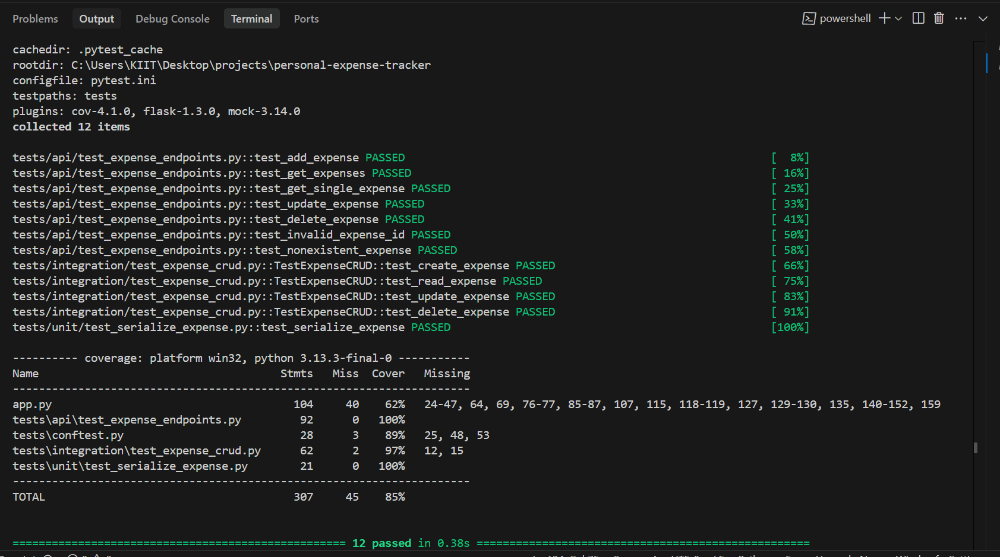
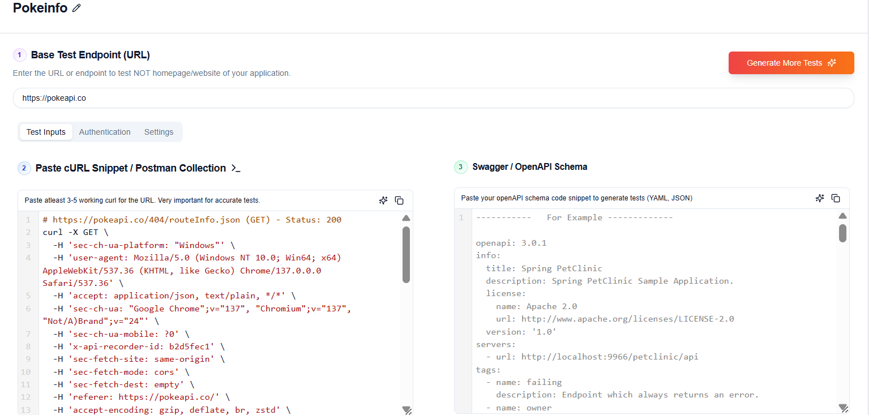
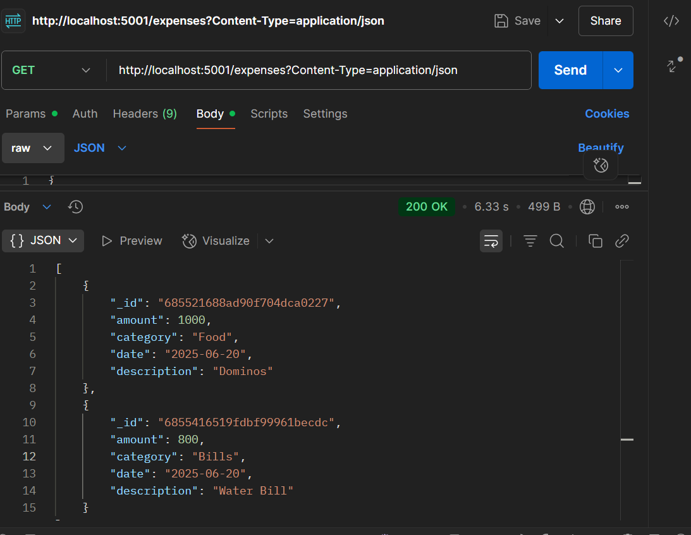

# 🧾 Personal Expense Tracker
A modern web application to track personal expenses with a clean, responsive interface, full CRUD functionality, and REST API integration.

---

## 📦 Assignment Submission – Keploy AI Testing & CI/CD

### OpenAPI Schema
See [`openapi.yaml`](./openapi.yaml).

### Keploy API Testing (Chrome Extension)
- API tested using the Keploy Chrome Extension and [https://app.keploy.io](https://app.keploy.io)
- Test cases generated for all CRUD endpoints.

**Test Evidence:**


### Postman API Test Results
API endpoints were also tested using Postman for local verification.

**Screenshot:**


### Sample cURL Commands
```sh
# Create expense
curl -X POST \
  -H 'content-type: application/json' \
  -d '{"description":"formal shoes","amount":100,"category":"Shopping","date":"2025-06-27"}' \
  'http://localhost:5001/expenses'
# List expenses
curl -X GET 'http://localhost:5001/expenses'
```

### CI/CD Integration (GitHub Actions Example)
> **Note:** Keploy CLI is not supported on Windows Docker Desktop due to kernel limitations. API testing was performed using the Chrome Extension and web platform. Example workflow below:

```yaml
name: Keploy API Test
on: [push, pull_request]
jobs:
  keploy-test:
    runs-on: ubuntu-latest
    steps:
      - uses: actions/checkout@v3
      - name: Show Keploy CLI Limitation
        run: echo "Keploy CLI is not supported on Windows Docker Desktop. See README for details."
```

### Keploy Chrome Extension on Public Websites
- [x] Used the Keploy Chrome Extension to record and generate tests on two public websites.

**Test Evidence:**


- Website: Reqres.in
- Action: Clicked "List Users" to trigger GET /api/users.


- Website: JSONPlaceholder
- Action: Loaded /posts endpoint in browser to trigger GET /posts.

> **Replace `image2.png` and descriptions above if you used a different site for your second test.**

### Blog Post
[Read my experience with Keploy API Testing](https://dev.to/anushka_verma_b98452a8d53/ai-driven-api-testing-with-keploy-my-experience-on-a-personal-expense-tracker-15og)


### Social Media Post
[My LinkedIn Post](https://www.linkedin.com/feed/update/urn:li:share:7344275440024375297/)


### Notes
- Keploy CLI recording/testing is not supported on Windows Docker Desktop (see [Keploy docs](https://docs.keploy.io/troubleshooting/limitations)).
- All API tests were verified locally and with the Chrome Extension/web platform.

---


# 🚀 Features
✅ Add, view, edit, and delete expenses  
✅ Categorize expenses (Food, Transport, Shopping, Bills, Entertainment, Other)  
✅ Search and filter expenses in real-time  
✅ Responsive design (works on mobile, tablet, desktop)  
✅ Modern dark theme UI  
✅ Full API integration with MongoDB backend  
✅ Comprehensive test coverage (85% overall)

# 🛠 Tech Stack
## Frontend
- HTML5, CSS3, JavaScript (Vanilla)
- Bootstrap 5, Bootstrap Icons

## Backend
- Python with Flask
- MongoDB Atlas (Cloud MongoDB)

## Testing
- Pytest, Pytest-cov
- Pytest-mock, Mongomock

## Development
- Local development setup (localhost)
- GitHub Actions (CI/CD)

# 🚦 Getting Started
## Prerequisites
- Python 3.8+
- MongoDB Atlas account (or local MongoDB)
- pip (Python package manager)

## Installation
1. Clone the repository:
   ```bash
   git clone https://github.com/yourusername/personal-expense-tracker.git
   cd personal-expense-tracker
   ```

2. Create and activate a virtual environment:
   ```bash
   # Create
   python -m venv venv
   
   # Activate
   # Windows:
   venv\Scripts\activate
   # Mac/Linux:
   source venv/bin/activate
   ```

3. Install dependencies:
   ```bash
   pip install -r requirements.txt
   pip install -r requirements-dev.txt  # For development
   ```

4. Configure environment variables:
   Create a `.env` file in the root directory:
   ```
   MONGO_URI=your_mongodb_connection_string
   FLASK_APP=app.py
   FLASK_ENV=development
   ```

## Running the Application
```bash
python app.py
# or
flask run --port=5001
```

Visit `http://localhost:5001` in your browser.

# 🧪 Testing
## Running Tests
```bash
# Run all tests with coverage
pytest --cov=app --cov=tests --cov-report=term-missing -v

# Run specific test types
pytest tests/unit/          # Unit tests
pytest tests/integration/   # Integration tests
pytest tests/api/           # API tests
```

## Test Coverage
**Current coverage: 85%**

```
---------- coverage: platform win32, python 3.13.3-final-0 -----------
Name                                     Stmts   Miss  Cover   Missing
----------------------------------------------------------------------
app.py                                   104     40    62%   24-47, 64, 69, 76-77, 85-87, 107, 115, 118-119, 127, 129-130, 135, 140-152, 159
tests/api/test_expense_endpoints.py       92      0   100%
tests/conftest.py                         28      3    89%   25, 48, 53
tests/integration/test_expense_crud.py    62      2    97%   12, 15
tests/unit/test_serialize_expense.py      21      0   100%
----------------------------------------------------------------------
TOTAL                                   307     45    85%
```


## Test Types
- **Unit Tests:** Test serialization and business logic (`tests/unit/`)
- **Integration Tests:** Test DB CRUD operations (`tests/integration/`)
- **API Tests:** Test all API endpoints with mocking (`tests/api/`)

# 🌐 API Documentation
## Base URL
```
http://localhost:5001
```

## Endpoints
### 1️⃣ Get All Expenses
**URL:** `/expenses`  
**Method:** `GET`  
**Response:**
```json
[
  {
    "_id": "60d5ec9e1c9d440000f2c1a1",
    "description": "Grocery shopping",
    "amount": 1500.50,
    "category": "Food",
    "date": "2023-06-20",
    "notes": "Weekly groceries"
  }
]
```

### 2️⃣ Add New Expense
**URL:** `/expenses`  
**Method:** `POST`  
**Request Body:**
```json
{
  "description": "Dinner",
  "amount": 1200,
  "category": "Food",
  "date": "2023-06-20",
  "notes": "Dinner with friends"
}
```
**Response:**
```json
{
  "status": "success",
  "expense_id": "60d5ec9e1c9d440000f2c1a1"
}
```

### 3️⃣ Update Expense
**URL:** `/expenses/<expense_id>`  
**Method:** `PUT`  
**Request Body:** Same as POST  
**Response:**
```json
{
  "status": "success",
  "message": "Expense updated successfully"
}
```

### 4️⃣ Delete Expense
**URL:** `/expenses/<expense_id>`  
**Method:** `DELETE`  
**Response:**
```json
{
  "status": "success",
  "message": "Expense deleted successfully"
}
```

# 📑 OpenAPI Schema
See [`openapi.yaml`](./openapi.yaml) for the complete API specification.

# 🤖 Keploy API Testing (Chrome Extension)
- API tested using the Keploy Chrome Extension and [https://app.keploy.io](https://app.keploy.io)
- Test cases generated for all CRUD endpoints.

**Test Evidence:**


# 🧪 Postman API Test Results
API endpoints were also tested using Postman for local verification.

**Screenshot:**


# 📝 Sample cURL Commands
```sh
# Create expense
curl -X POST \
  -H 'content-type: application/json' \
  -d '{"description":"formal shoes","amount":100,"category":"Shopping","date":"2025-06-27"}' \
  'http://localhost:5001/expenses'

# List expenses
curl -X GET 'http://localhost:5001/expenses'
```

# ⚙️ CI/CD Integration (GitHub Actions Example)
> **Note:** Keploy CLI is not supported on Windows Docker Desktop due to kernel limitations. API testing was performed using the Chrome Extension and web platform. Example workflow below:

```yaml
name: Keploy API Test
on: [push, pull_request]
jobs:
  keploy-test:
    runs-on: ubuntu-latest
    steps:
      - uses: actions/checkout@v3
      - name: Show Keploy CLI Limitation
        run: echo "Keploy CLI is not supported on Windows Docker Desktop. See README for details."
```

# 🌐 Keploy Chrome Extension on Public Websites
- [x] Used the Keploy Chrome Extension to record and generate tests on two public websites.

**Test Evidence:**


- Website: Reqres.in
- Action: Clicked "List Users" to trigger GET /api/users.


- Website: JSONPlaceholder
- Action: Loaded /posts endpoint in browser to trigger GET /posts.

# 📝 Blog Post
[Read my experience with Keploy API Testing](<YOUR_BLOG_LINK_HERE>)

# 📢 Social Media Post
[My LinkedIn/Twitter Post](<YOUR_SOCIAL_LINK_HERE>)

# ℹ️ Notes
- Keploy CLI recording/testing is not supported on Windows Docker Desktop (see [Keploy docs](https://docs.keploy.io/troubleshooting/limitations)).
- All API tests were verified locally and with the Chrome Extension/web platform.

# 🖼 Screenshots


# 🤝 Contributing
1. Fork the repository
2. Create your feature branch (`git checkout -b feature/AmazingFeature`)
3. Commit your changes (`git commit -m 'Add some AmazingFeature'`)
4. Push to the branch (`git push origin feature/AmazingFeature`)
5. Open a Pull Request

# 📄 License
This project is licensed under the MIT License - see the [LICENSE](LICENSE) file for details.

---

## 📝 Assignment Notes
- This repository contains unit, integration, and API tests for the Personal Expense Tracker API.
- All tests are passing with **85%** test coverage.
- See the API section for endpoint details and testing instructions.

**Assignment complete!**
